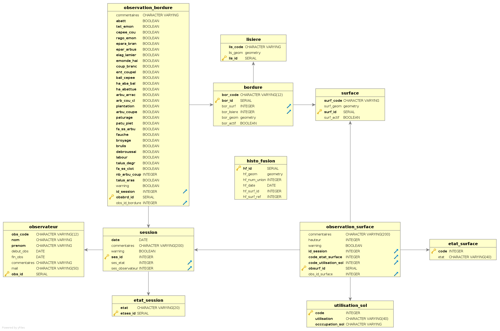

# Bagap - Bordure/Parcelle

Détail de fonctionnement du projet, listing des actions réalisées sur la base de données et fonctionnement des interfaces créées.

## Introduction
Ce projet à pour but le suivi d'occupations et d'entretiens de parcelles et de bordures.

Une observation se fait sur une parcelle et une bordure à une date donnée décrite lors d'une session.
## Sommaire
* [SQL](#sql)
* [Interface Terrain](#field)
* [Interface Bureau](#dektop)

### I) <a id="sql">SQL</a>
***
Les fichier *__update_keys.sql__*, *__view.sql__*, *__function.sql__* et *__trigger_maj_bordure.sql__* listent les modifications apportées à la base de données.

* **update_keys.sql** réorganise la base de données en ajoutant, modifiant et supprimant des colonnes et des contraintes sur les tables.
  * Ajout des champs de géométrie
  * Modification des clé primaires et étrangères
  * Mise à jour des données en fonction des nouvelles contraintes
  * Ajout de la table histo_fusion listant les entités à fusionner
  * Ajout d'un utilisateur "Terrain" pour une modification des observation seulement sur la session courante.

* **view.sql** créé les vues utilisées pour les interfaces.
  * *mv_zone*

  Cette vue créé et liste la géométrie des zones par l'union des parcelles de chacune des zones (connues par la première lettre de leur code).
  * *v_mod_session*

  Cette vue récupère simplement les informations relationnelles d'une session pour pouvoir afficher ces valeurs à la place des identifiant des clés étrangères.
  * *v_mod_bordure*

  Cette vue récupère simplement les informations relationnelles d'une bordure pour pouvoir afficher ces valeurs à la place des identifiant des clés étrangères.
  * *v_observation_bordure*

  Cette vue liste les observations réalisées sur la session courante avec la géométrie des bordures. Si aucune observation n'est encore signalée, une entité est tout de même créée avec des valeurs par défaut. C'est la vue qui va nous servir pour l'insertion des observation de bordure par des entités géographiques sur l'interface terrain de notre application.
  * *v_observation_bordure_tot*

  Cette vue liste toutes les observations réalisée couplée à la géométrie des bordures. Elle est utilisée pour afficher les observations des bordures sur l'interface bureau et simplifier l'interaction.
  * *v_observation_surface*

  Cette vue liste les observations réalisées sur la session courante avec la géométrie des parcelles. Si aucune observation n'est encore signalée, une entité est tout de même créée avec les valeurs des dernières observation effectuées sur la parcelle. C'est la vue qui va nous servir pour l'insertion des observation de parcelles par des entités géographiques sur l'interface terrain de notre application.
  * *v_observation_surface_tot*

  Cette vue liste toutes les observations réalisée couplée à la géométrie des parcelles. Elle est utilisée pour afficher les observations des parcelles sur l'interface bureau et simplifier l'interaction.  
  * *v_observation_fusion*

  Certaines parcelles peuvent évoluer dans le temps et fusionner, mais la fusion n'est visualisable que sur le terrain. Ainsi, une observation sur une parcelle fusionnée par l'union de trois autres se fait en réalité sur les trois parcelles. C'est avec cette vue que l'on récupère les informations des observations concernant les parcelles fusionnées. On créé ainsi des entités virtuelles fusionnées qui vont pouvoir avec un trigger réorienter les données dans les parcelles à l'origine de la fusion.
  * *mv_fusion_surface*

  Cette vue matérialiser liste les géométries des parcelles qui ont fusionnées.

* **function.sql** cré les fonctions de calcul et d'insertion.
  * *fun_create_bordure()*

 Cette fonction est utilisée une seule fois et permet la création de la géométrie des bordures. La géométrie d'une bordure correspond alors à un buffer de la lisière coupé par rapport à la parcelle correspondante à la bordure.
  * *fun_repare_bordure()*

  Cette fonction est utilisée une seule fois et réalise une correction de la géométrie des bordures pour éviter les superpositions. Elle va supprimer les parties superposées sur la bordure comprenant la surface la plus grande, dans le but de garder une zone cliquable suffisamment importante.
  * *fun_warning() -  Trigger*

  Cette fonction active automatiquement les warnings lorsqu'un commentaire est entrée dans une table.
  * *fun_edit_session() - Trigger*

  Cette fonction gère l'utilisation des session. Elle contraint la mise à jour étape par étape. La création d'une session n'est possible que la dernière session est validée. Il ne peut y avoir qu'une seule fois la même étape d'une session à l'exception de l'état "terminé".
  Il reste cependant possible de revenir à l'état "en cours", lorsque l'état courent est "à valider". Elle se lance lorsqu'une modification se fait sur la table session.
  * *fun_close_session() - Trigger*

  Cette fonction change automatiquement l'état de la session à "à validée" lorsque toutes les observation ont été réalisés. Elle est lancée pour chacune des nouvelles observation et calcul si c'est la dernière observation ou s'il en reste d'autre.
  * *fun_edit_terrain() - Trigger*

  Cette fonction restreint les modification de l'utilisateur terrain. Elle insère la donnée seulement si la session concernée est la courante, elle renvois une erreur dans le cas contraire.
  * *fun_edit_from_obs() - Trigger*

  Cette fonction met automatiquement à jour une session à l'état "en cours" lorsqu'une observation est ajoutée sur une session à l'état "créée".
  * *fun_obs_bord_maj() - Trigger*

  Cette fonction rend possible l'édition d'une vue. Elle détourne l'insertion de la vue "v_observation_bordure" vers la table "observation_bordure".
  * *fun_obs_surf_maj() - Trigger*

  Cette fonction rend possible l'édition d'une vue. Elle détourne l'insertion de la vue "v_observation_surface" vers la table "observation_surface".
  * *fun_tri_intersect_fusion() - Trigger*

  Cette fonction gère l'insertion des parcelles à fusionner. Elle met à jour les champs "hf_surf_id" et "hf_surf_ref" en fonction de l'intersection entre le point et les parcelles, ainsi que le numéro de l'union.
  La dernière étape est de recharger la vue matérialisée des fusions des parcelles.
  * *fun_tri_obs_fusion() - Trigger*

  Cette fonction rend possible l'édition d'une vue. Elle détourne l'insertion de la vue "v_observation_fusion" vers la table "observation_surface".

### II)	Interface terrain <a id="field">Field</a>
***
Cette interface est vouées à être utilisée sur le terrain.

Les contraintes pour cet affichage sont :
* Ajouter des observations dans le cas où une session est présente
* Modifier seulement les observations de la session en cours
* Afficher les observations de la dernière session
* Suivre l'avancement du parcours sur le terrain

#### Projet QGIS
Les couches contenus dans ce projet sont les suivantes :

<table>
  <tr>
    <td rowspan=11>
      
    </td>
    <td>
      **lisiere :** Affichage géographique des lisières.    
    </td>
  </tr>
  <tr>
    <td>
      **v_observation_bordure :** Affichage géographique des observation de bordures de la session courante.
    </td>
  </tr>
  <tr>
    <td>
      **v_observation_fusion :** Affichage géographique des observation de surfaces fusionnées.
    </td>
  </tr>
  <tr>
    <td>
      **v_observation_surface:** Affichage géographique des observation de surfaces courante ou de la dernière session.
    </td>
  </tr>
  <tr>
    <td>
      **mv_zone: ** Affichage géographique des trois zones de suivi.
    </td>
  </tr>
  <tr>
    <td>
      **utilisation_sol :** Couche donnant les valeurs relationnelles des types d'utilisation et d'occupation du sol.
    </td>
  </tr>
  <tr>
    <td>
      **etat_surface:** Couche donnant les valeurs relationnelles des types d'état d'une surface.
    </td>
  </tr>
  <tr>
    <td>
      **session :** Couche donnant l'information sur l'état des sessions. Seulement les deux dernières sont prises en compte.
    </td>
  </tr>
  <tr>
    <td>
      **v_mod_session :** Couche donnant les valeurs sous forme de libellé pour l'affichage des sessions dans la table attributaire. Cette couche est jointe à la couche session.
    </td>
  </tr>
  <tr>
    <td>
      **observateur :** Couche donnant les valeurs relationnelles des observateurs d'une session.
    </td>
  </tr>
  <tr>
    <td>
      **etat_session :** Couche donnant les valeurs relationnelles des états d'une session.
    </td>
  </tr>
</table>

  *  Entités géographiques présentes pour la reconnaissance du terrain.

  *   Entités présentes pour l'ajout d'information par modification de la base de données de façon géographique.

  *   Entités présentes pour zoomer rapidement sur les entités voulues.

  *   Entités présentes pour afficher les valeurs relationnelles sous forme de libellé dans les popups et formulaires d'édition.

  *   Entités présentes pour donner des informations supplémentaires et non géographiques.

  *   Entités présentes pour afficher les valeurs relationnelles sous forme de libellé dans la table attributaire. 

###### Paramétrage des champs
L'affichage dans lizmap utilise les paramètres de QGIS. Nous allons donc définir les champs que nous voulons voir dans les popups et les formulaires d'édition. Pour ce faire, nous allons dans les ** *propriétés de la couche* ** puis dans l'onglet ** *Champs * **
* *Session*

Les session vont être affichées sous forme de table attributaire, nous avons donc besoin d'ajouter une jointure pour récupérer les champs sous forme de libellés. Cette couche est également éditable, tous les champs doivent donc apparaître dans une popup.

  1. Champs provenant de la jointure qui seront affichés dans la table attributaire de Lizmap
  2. Champs cachés à l'utilisateur mais prenant des valeurs automatiquement dans la base de données
  3. Champs à afficher pour l'utilisateur avec un Alias compréhensible et des valeurs relationnelles ajoutés pour remplacer les champs clés étrangères par des libellés

* *Observation bordures*

  Les observations de bordure seront simplement afficher à l'aide de popups et éditables. La couche contenant des champs booléens, il faut les afficher sous la forme de case à cocher et donner en alias des noms pertinents. De plus, la table contient un grand nombre de champs, nous décidons donc de les regrouper par des onglets à l'affichage. De la même façon que la session des champs vont rester caché du fait qu'ils ne sont pas utiles à l'utilisateur, mais important tout de même pour la base de données.

1. Mise en forme de boîte à cocher avec comme valeur TRUE (coché) et FALSE (décoché)
2. Organisation du formulaire par cliquer/glisser sous forme d'onglets

* *Observation surface*

  Les couches fusion et surface possèdent les mêmes type d'entité, leur paramétrage est ainsi identique. Nous utilisons le cliquer/glisser pour n'afficher que les champs qui nous intéressent. Nous utilisons également les valeurs relationnelles, cachées, boîte à cocher vues précédemment.

###### Paramétrage de la symbologie
  La symbologie est importante pour une meilleure visualisation de l'avancement du travail. Sur l'interface dédiée au terrain, nous voulons pouvoir repérer d'un coup d'oeil le travail que nous venons d'effectuer. Nous recherchons donc ici à différencier les données à enregistrer des données déjà présentes. La symbologie se fera donc sur les couches concernant les observations (de bordure et de surface). Afin de ne pas mélanger les entités, nous donnons deux couple de couleur différentes, une pour les bordures et l'autre pour les parcelles.

1.  Remplissage vert clair pour indiquer les observation réalisée pour la session en en cours
1.  Remplissage rouge pour les observations qui ne sont pas encore renseignées pour la session courante.

1.  Remplissage bleu pour les observations qui ne sont pas réalisée et pour contraster avec le vert des bordures.
1.  Remplissage rouge pour les observations qui ne sont pas encore réalisées. Les points noir sont présent pour contraster la symbologie des bordures.

#### Paramètres Lizmap
   Pour cette interface, nous avons besoin d'afficher à la carte les lisières, bordures et surface, nous gardons ainsi dans la légende les couches lisiere, v_observation_surface et v_observation_bordure. Nous activons les popups pour les bordures et les surfaces dont nous voulons connaître les observations. Nous ajoutons la session en table attributaire.

   Pour finir, nous permettons l'édition et la suppression des couches v_observation_bordure, v_observation_surface et session.
###### Paramétrage des actions
   

   

   

   

###### Paramétrage de l'affichage

   

   

   

Nous pouvons maintenant lancer l'interface sur le web, et visualiser nos couches, cliquer sur les entités et éditer des observations qui se mettrons à jour instantanément.
 en changeant de couleur.

### III)	Interface bureau 
